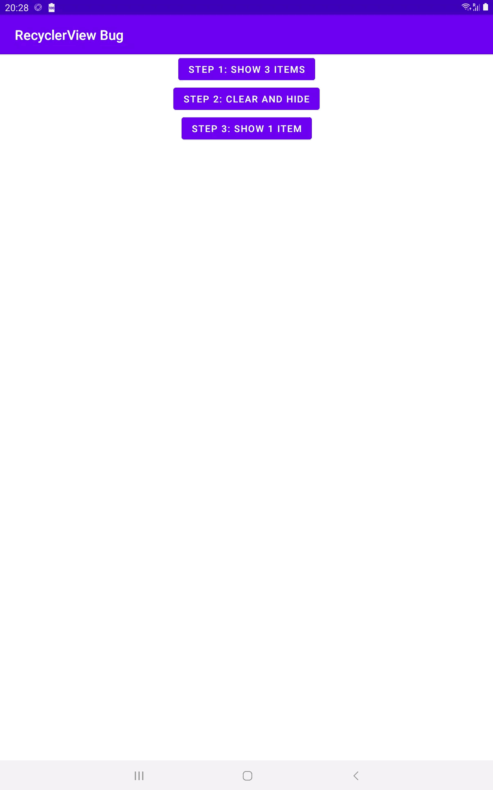

# Bug reproduction #

## Steps ##

1. Build and launch the app
2. Click the buttons from top to bottom ("Step 1", "Step 2", Step 3")
3. Observe the RecyclerView contents

When "Step 3" button is clicked, RecyclerView shows the previously
visible items for a brief moment and then replaces them with a single
item, despite that in "Step 2" an empty list was submitted just before
hiding the RecyclerView by changing it's visibility to `View.GONE`

## Preview ##

